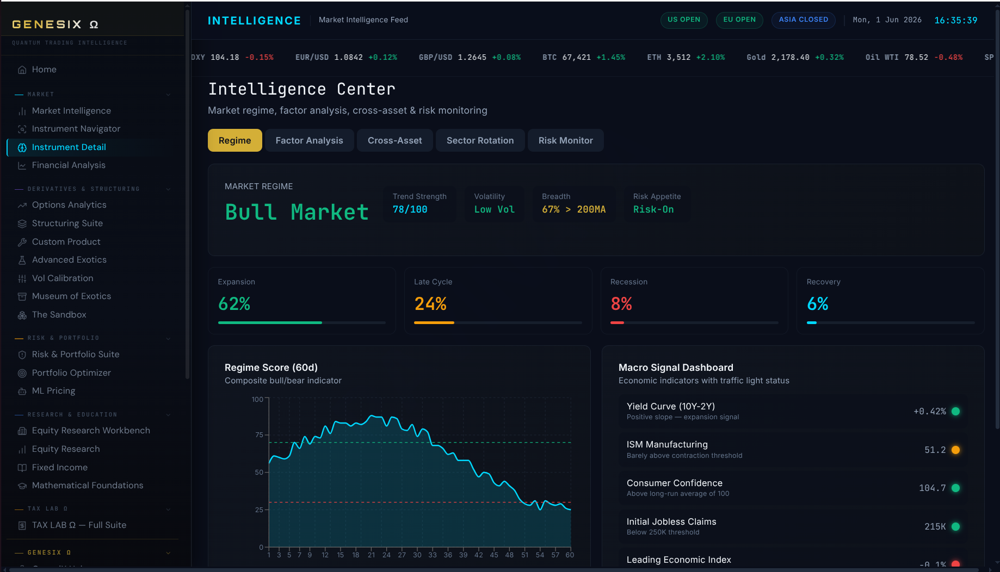

# Ravinala

Ravinala est une plateforme de finance de marché que j'ai développée comme projet personnel : pricing de produits dérivés, optimisation de portefeuille, calcul de risque, et quelques agents IA pour automatiser des analyses. Le tout dans une interface web qui ressemble à un terminal type Bloomberg/LSEG.

[](LICENSE)
[](montecarlo/backend/requirements.txt)
[](ravinala-web/tsconfig.json)
[](montecarlo/backend/requirements.txt)
[](ravinala-web/package.json)
[](montecarlo/deployment/docker-compose.yml)

Pour lancer : `docker compose up -d` puis http://localhost:5173



## Pourquoi ce projet

Ce projet reflète ma volonté constante d'approfondir la théorie financière par une approche appliquée. Plutôt que de me limiter à l'analyse théorique, j'ai choisi de concevoir et d'implémenter mes propres outils de marché afin de maîtriser les mécanismes sous-jacents de la modélisation.

Cette plateforme se structure autour de deux axes opérationnels :

Moteur de Pricing : Implémentation rigoureuse de modèles dérivés (Black-Scholes et dérivés). L'objectif est de garantir une compréhension fine des sensibilités et des hypothèses de valorisation par la pratique du code.

Aide à la Gestion d'Allocation : Outil dédié à l'optimisation de portefeuille (Markowitz, VaR), conçu pour transformer des concepts théoriques en décisions d'allocation actionnables.

Objectifs du projet
Ce développement démontre une double compétence, essentielle pour appréhender les enjeux de la finance de marché moderne :

Maîtrise Quantitative : Capacité à modéliser et à valider des instruments financiers complexes via une implémentation logicielle fiable.

Maîtrise Technique : Conception d'une infrastructure robuste (Backend, BDD, Frontend, déploiement) permettant de transformer des modèles mathématiques en outils de production scalables.

## Lancer l'application

Il faut juste Docker d'installé ([Docker Desktop](https://www.docker.com/products/docker-desktop)). Pas besoin de Python, Node ou PostgreSQL en local.

```bash
git clone https://github.com/Ma2t-prog/Ravinala.git
cd Ravinala/montecarlo/deployment
docker compose up -d
```

Aucune configuration à faire : la base, le mot de passe et le cache sont préconfigurés avec des valeurs par défaut.

Laissez tourner 30 à 60 secondes le temps que tout démarre, puis :

- Application : http://localhost:5173
- API + documentation Swagger : http://localhost:8000/docs
- Suivi des agents IA : http://localhost:5173/agents/monitor

Pour arrêter : `docker compose down`

Les agents IA ont besoin d'une clé `ANTHROPIC_API_KEY` (à mettre dans le `.env`) pour fonctionner pleinement. Sans elle, le reste de l'application marche quand même.

## Les modules

L'appli est découpée en pôles, un peu comme les différents écrans d'un terminal financier.

**Produits dérivés.** La partie la plus quantitative. Pricing d'options en Black-Scholes et Monte Carlo, options exotiques (barrières, asiatiques, lookback), un designer pour construire ses propres payoffs structurés, et des surfaces de prix/volatilité.

**Risque.** Calcul de VaR, sensibilités (les Greeks : Delta, Gamma, Vega...), stratégies de couverture, backtesting, et un module de pricing assisté par machine learning.

**Portefeuille.** Optimisation moyenne-variance et CVaR (Markowitz), attribution de performance, analyse de scénarios, suivi des positions.

**Recherche.** Analyse fondamentale d'actions, valorisation d'entreprises (DCF, multiples), exploration d'ETF et de l'univers d'investissement.

**Agents IA.** La partie sur laquelle j'ai le plus appris. Des agents construits avec LangGraph et Claude qui enchaînent plusieurs étapes de raisonnement pour analyser ou surveiller un portefeuille. On peut suivre leur activité depuis le dashboard.

**Marché, conformité, apprentissage.** Données de marché et macro, scoring ESG, capital réglementaire (Bâle III), génération de rapports, et quelques pages pédagogiques sur les maths financières.

## Stack technique

Frontend en React 19 / TypeScript avec Vite. Backend en Python avec FastAPI. Les calculs quant s'appuient sur NumPy, pandas et scipy ; le ML sur scikit-learn. Les agents utilisent LangGraph et l'API Claude. Côté données, PostgreSQL (avec TimescaleDB pour les séries temporelles) et Redis pour le cache.

Tout est conteneurisé : un seul `docker compose up` lance les quatre services (base, cache, API, interface).

```
Frontend (React/TS)
        │  HTTP / WebSocket
Backend (FastAPI)
   - moteurs quant (pricing, risque, allocation)
   - agents autonomes (LangGraph + Claude)
   - pipelines ML
        │
Données : PostgreSQL + TimescaleDB · Redis
```

## Organisation du code

```
Ravinala/
├── montecarlo/
│   ├── backend/app/
│   │   ├── routes/        endpoints API (market, risk, portfolio, agents...)
│   │   ├── services/      logique métier (pricing, optimisation, risque)
│   │   ├── agents/        agents LangGraph (graph, nodes, runner)
│   │   ├── risk/          moteur de risque et stress-testing
│   │   ├── allocation/    allocation d'actifs
│   │   └── ml/            pipelines machine learning
│   └── deployment/        Docker Compose, Dockerfiles, schéma SQL
│
└── ravinala-web/src/
    ├── pages/             modules : derivatives, risk, portfolio, research...
    ├── components/        composants UI
    └── api/               appels API
```

## API

Une fois lancé, la documentation interactive est sur `/docs` (Swagger) ou `/redoc`. Quelques endpoints clés :

- `POST /api/portfolio/optimize` — optimisation de portefeuille
- `GET /api/market/indices` — données de marché
- `POST /api/derivatives/price` — pricing de dérivés
- `GET /api/risk/analytics` — métriques de risque

## Licence

MIT (voir [LICENSE](LICENSE)).
